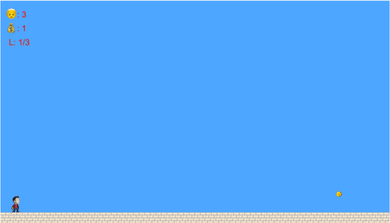
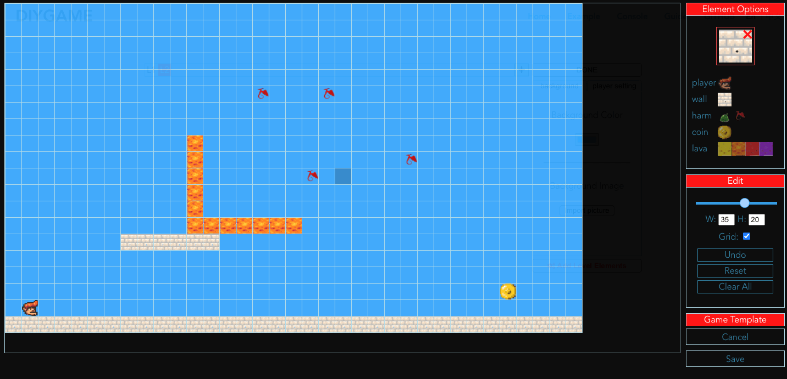
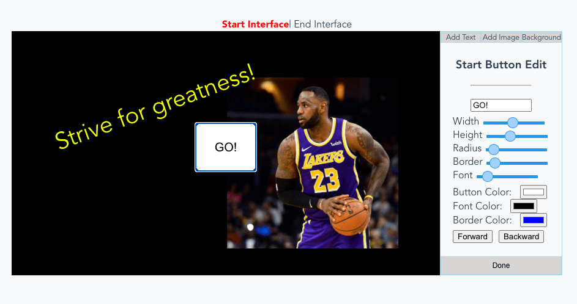

[中文](./README_ch.md)

# DIYGame
DIYGAME is a pure front-end web application. User can make platform game **without any coding** on it. The game could be saved as an HTML file and run in the browser.

## Home page

[Home page of DIYGAME](http://diygame.vip/#/)

## What you can do

### Example 1: Make your own player character

[GIF demo](./README/playerFigure.md)

### Example 2: Design game level

[GIF demo](./README/structureDesign.md)

### Example 3: Design game interface

## A complete instance:

[A complete instance](http://diygame.vip/#/previewPage) made by DIYGAME。

## Try Now:

Please visit on PC:
[DIYGAME console](http://diygame.vip/#/entireGame)。

## User Guide with video demo:

[DIYGAME Guide](http://diygame.vip/#/help)

## 

If you like my work, please give me a star✨. Thank you very much.
