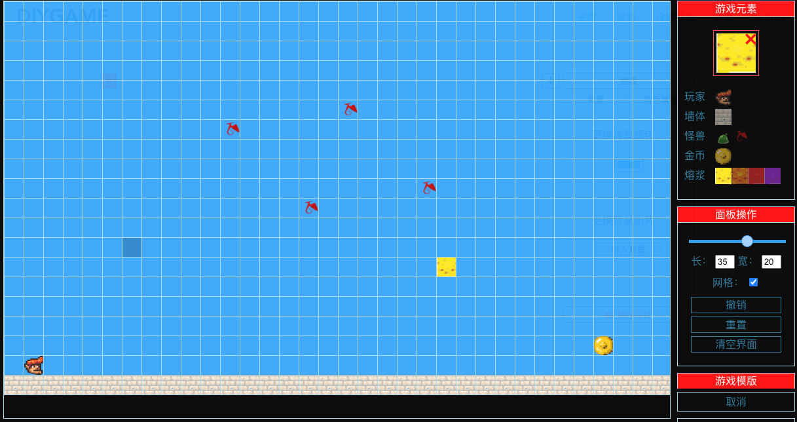

[English](./README.md)

# DIYGame
DIYGame是一个纯前端的应用。使用者可以在**不写任何一行代码**的情况下DIY一款冒险游戏。最终设计的游戏以html文件的形式下载下来，可以在浏览器上运行。

## 主页

[DIYGAME主页介绍](http://diygame.vip/#/)

## 设计示例

### 示例1:游戏角色形象设计

[GIF动画演示](./README/playerFigure.md)

### 示例2:游戏关卡设计

[GIF动画演示](./README/structureDesign.md)

### 示例3:游戏的开始与结束界面设计

## 简单的设计实例

用DIYGAME来设计的[一个简单的游戏实例](http://diygame.vip/#/previewPage)

## 马上试一试：

以上都只是可设计范围的冰山一角，想要了解全部内容，建议马上尝试：[DIYGAME设计总台](http://diygame.vip/#/entireGame)。
请用电脑端来访问。

## 使用指南

[DIYGAME帮助](http://diygame.vip/#/help)

## 技术栈

- vue
- vuex
- vueRouter
- vue-cli
- sass

## 其他

如果喜欢该作品，希望给个star✨，感谢🙏
